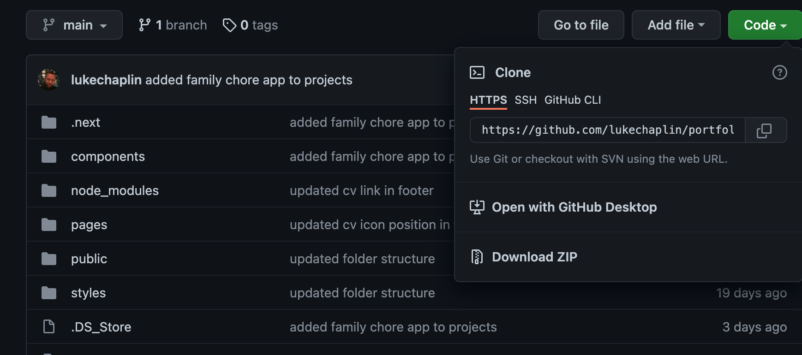
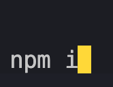

# Portfolio Website

My portfolio website - created with react and bootstrapped with Next.js & Tailwind CSS

NB: This is a re-build of my original portfolio site which you can see here which was built in vanilla languages: [original portfolio](https://github.com/SchoolOfCode/w4d1_week3-recap-lukechaplin)

## Contents

1. Getting started
2. Sections
   1. Components
   2. Pages
3. Current Issues

### Getting Started

To open the list app code base, clone down the code base from github, as shown below.
_NB: Code is public_

Link to github:

_Remember to install npm i dependencies_

### Sections

The below shows the structure of the components and pages for my site.

#### Components

1. Components

   1. About: rendering function that produces a page which has a brief description about myself.
   2. Contact: rendering function that produces a page which incoporates a contact form linked to my basin account - where enquires are sent.
   3. Footer: rendering function that produces the footer for each page which includes clickable social media icons linked to my social media accounts and CV. Also contains a get year function.
   4. InterestingFacts: rendering function that produces a page with interesting facts about myself.
   5. Intro: rendering funciton that produces a brief welcome message for my portfolio site, imported into main index (landing) page.
   6. Logo: rendering function that produces my site logo impored into the main index (landing) page.
   7. Navbar: Contains two rendering functions that produce the desktop navbar and mobile navbar based on viewport size and imported into the header for each page.
   8. Projects: rendering function that produces a page with a list of clickable thumbnails that link to my github projects.

2. Pages

   1. app.js: Main javascript file that imports all other pages and associated imported functions so next will run correctly.
   2. about.js: about page which contains the imported about me function.
   3. contact.js: contact page which contains the imported contact form function.
   4. index.js: contains the page which contains the imported intro function (acts as landing page for site).
   5. interesting.js: contains the page which contains the imported interesting facts function.
   6. projects.js: contains the page which contains the imported projects function.

### Current Issues

N/A
